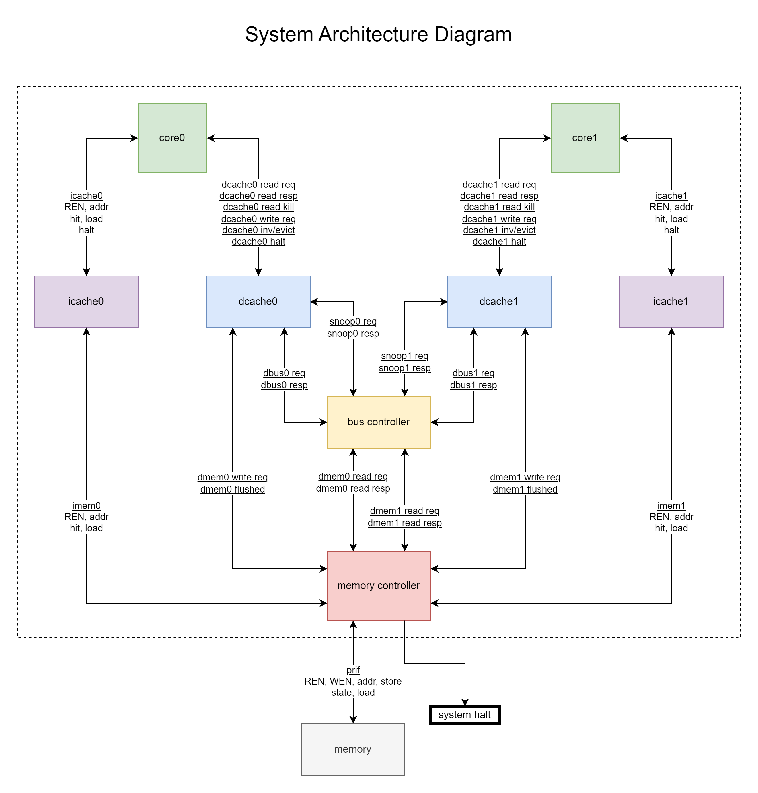
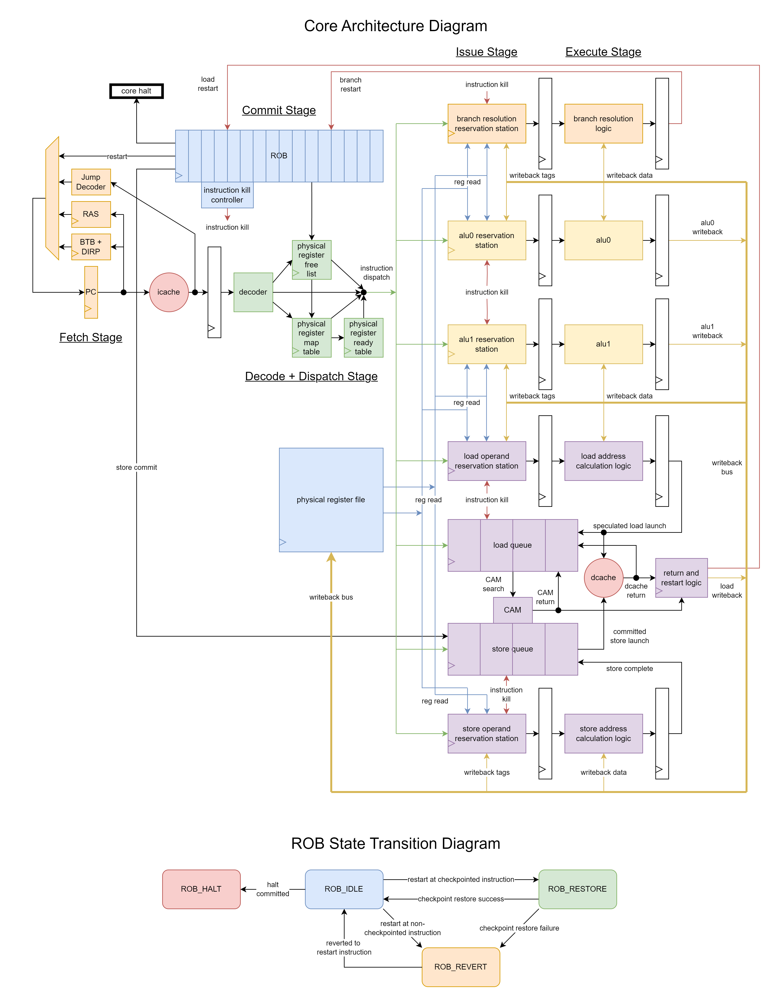
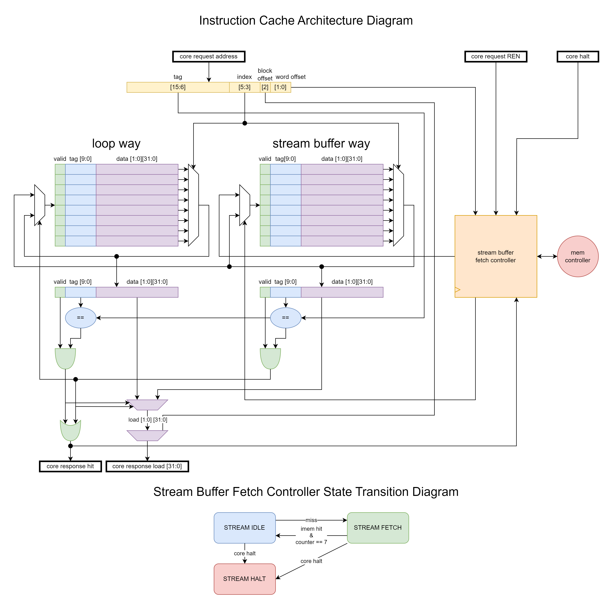
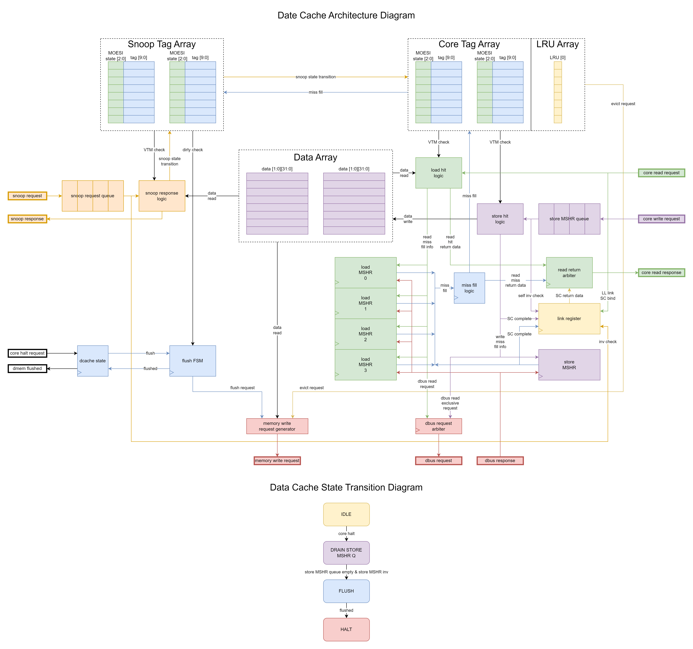

# 437_OoO
437_OoO is a MIPS dual-core out-of-order CPU implementation based in the Purdue ECE 437 infrastructure. This design was encouraged by architecture lectures in Purdue ECE 437, ECE 565, and ECE 666.

> **_WARNING TO STUDENTS_**
> 
> If you are a student in ECE 437 trying to copy from this design for your labs, you will find your effort completely wasted for the following reasons:
>  - this design is unbelievably far outside of the expected microarchitecture specification for the labs
>    - there is not a single module or testbench for a module that will get you a checkoff in the labs
>    - the design will fail all cache lab test cases due to the dcache hit counter
>    - the design will fail some racey multicore lab test cases since these expect your core requests and bus to behave a certain way
>  - this design does not use the required interfaces
>  - Purdue ECE 437 will be using RISC-V instead of MIPS starting Fall 2024!
>
> ECE 437 is an excellent class for learning computer architecture and RTL design and verification. You will learn much more by developing designs on your own, with your partner, or with TA help.

## Contents
- [Goals](#goals)
- [Constraints](#constraints)
- [Architecture](#architecture)
  - [System](#system)
  - [Core](#core)
  - [Instruction Cache](#instruction-cache)
  - [Data Cache](#data-cache)
  - [Bus Controller](#bus-controller)
  - [Memory Controller](#memory-controller)
- [Testbenches](#testbenches)
- [Assembly Unit Tests](#assembly-unit-tests)
- [Synthesis Results](#synthesis-results)
- [Performance Results](#performance-results)
- [Notes](#notes)
- [Potential Future Development](#potential-future-development)

## Goals
- implement R10K-based out-of-order core
- implement split-transaction, pipelined bus
- use MOESI snoopy cache coherence protocol with bus controller for sequential consistency
- use MSHRs, non-blocking caches
- system should act as memory bandwidth maximizing machine, not individual operation latency minimizer since have out-of-order to cover latencies
- target daxpy/vector add behavior

## Constraints
- based in Purdue ECE 437 infrastructure
  - 1x blocking 32-bit ram interface with ((LAT + 1)/2) CPUCLK cycles of latency
    - benchmark for LAT={0,2,6,10}
  - lower 16-bit address space
- MIPS 32-bit integer subset
  - see 437_OoO/asm_i.txt

## Architecture
This section details the architecture and microarchitecture of the design. 

### System

https://github.com/zlagpacan/437_OoO/blob/main/processors/source/system.sv

- everything within the dotted lines is part of the 437_OoO design
- dual-core
- MOESI snoopy cache coherence
- pipelined, split-transaction bus
- TSO memory consistency
  - only acts as TSO in single very specific case
  - in vast majority of cases, behavior follows Sequential Consistency
- out-of-order cores
- blocking icaches
- non-blocking dcaches

### Core

https://github.com/zlagpacan/437_OoO/blob/main/processors/source/core.sv

- based on R10K out-of-order design
  - true register rename with physical register file, map table, free list
  - different from R10K: decided to use reservation stations in execution pipelines instead of proper issue queue
    - reservations stations can much more easily support back-to-back forwarding of values on write data buses
  - target vector add program
  - bare minimum memory dependence handling for the sake of sanity
    - no dependence prediction
    - no checkpointing of loads
    - always immediately try to load from dcache
    - if dcache load comes first but should have used SQ value, need restart
      - also restart if dcache invalidates or evicts block to maintain Sequential Consistency
  - Front End
    - Fetch
    - Dispatch
    - ROB
  - Back End
    - Physical Register File
    - 2x ALU Pipelines
    - Branch Resolution Pipeline
    - Load-Store Queue
- Fetch Stage
  - https://github.com/zlagpacan/437_OoO/blob/main/processors/source/fetch_unit.sv
  - fetch instructions from icache
  - on hit, determine next PC
    - PC+4 or speculated branch prediction
  - branch prediction
    - 32-entry BTB+DIRP
    - 8-entry RAS
    - pre-decode instructions to check for irregular control flow
      - use BTB+DIRP if BEQ/BNE
      - immediately jump following immediate bits if J, JAL
      - use RAS if JR
      - simplifies work branch pipeline must do
        - if any instruction that satisfies hash can use BTB+DIRP or RAS, then every instruction must be checked for the correct next PC
      - ended up not being critical path so perfectly fine
- Decode + Issue Stage
  - https://github.com/zlagpacan/437_OoO/blob/main/processors/source/dispatch_unit.sv
  - decode, read register map table and ready table, dequeue physical register free list, try to dispatch to associated pipeline(s)
    - Physical Register Map Table
      - https://github.com/zlagpacan/437_OoO/blob/main/processors/source/phys_reg_map_table.sv
      - map architectural register to physical register
      - gives current in-order dispatch register rename
      - source operands read the table
      - destination operands reads the table to get the old mapping and writes the table with the new rename mapping
    - Physical Register Ready Table
      - https://github.com/zlagpacan/437_OoO/blob/main/processors/source/phys_reg_ready_table.sv
      - tells if physical register value is ready or yet to be written at time of dispatch
    - Physical Register Free List
      - https://github.com/zlagpacan/437_OoO/blob/main/processors/source/phys_reg_free_list.sv
      - gives list of free physical registers which can be used for a rename
      - dequeue on dispatch of register-writing instruction
      - enqueue on commit of register-writing instruction with physical register used before new rename of architecture register for this instruction
  - on successful dispatch, instruction goes to 0, 1, or 2 pipelines
    - 0: J, dead instructions (write to reg 0)
    - 1: reg writing instructions, BEQ, BNE, JR, LW, LL, SW
    - 2: SC, which goes to LQ and SQ
- Execute Stage
  - Physical Register File
    - https://github.com/zlagpacan/437_OoO/blob/main/processors/source/phys_reg_file.sv
    - 64 physical registers
    - register file is read by reservation stations in execution pipeline
    - 2x read ports, corresponding to the reservation station that wins access for the cycle
    - 3x write ports, 1x for each write data bus
    - to better support forwarding, must support same-cycle write and read
  - 2x ALU Pipelines
    - https://github.com/zlagpacan/437_OoO/blob/main/processors/source/alu_pipeline.sv
    - perform instructions which require an ALU operation
      - and also some instructions that simply need to write registers
        - LUI, JAL, etc.
    - pipelines fully independent
    - 1x ALU each
    - 1x write data bus each
    - primary reasoning behind having 2 pipelines targets vector add program
      - vector element add can be in one pipeline's RS, waiting for load misses and the independent index add operation is free to proceed in the other pipeline
  - Branch Resolution Pipeline
    - https://github.com/zlagpacan/437_OoO/blob/main/processors/source/bru_pipeline.sv
    - ensure conditional branch instructions branched to the correct PC
      - namely BEQ, BNE, JR
    - can send precise interrupt request to ROB
  - Load-Store Queue
    - https://github.com/zlagpacan/437_OoO/blob/main/processors/source/lsq.sv
    - 4-entry Load Queue
    - 4-entry Store Queue
    - 2x operand collection pipelines
      - one for loads, one for stores
    - CAM to check for memory dependence, SQ forward for load value
    - CAM to check for load queue entries matching invalidates or evicted dcache blocks, which can trigger instruction restart to allow sequential consistency for speculated loads
    - can send precise interrupt request to ROB
      - missed SQ forward value or dcache invalidated or evicted block
    - support LL with link register in dcache
    - support SC by sending conditional write request and conditional read request to dcache
      - conditional read request effectively returns to core like a load
  - Physical Register Read Bus
    - blue bus in architecture diagram
    - multiple reservation stations can attempt physical register file reads, only single reservation station's read is serviced per cycle
      - read priority: LQ > ALU0 > ALU1 > BRU > SQ
  - Writeback Buses
    - yellow buses in architecture diagram
    - write back value to physical register file
    - provide physical register tag and value to forward into reservation stations
  - Instruction Restart and Kill Buses
    - pink buses in architecture diagram
    - restart bus: execution units communicate an instruction restart to ROB
    - kill bus: ROB communicates executing instructions to be killed in the execution units
- Commit Stage
  - Reorder Buffer (ROB)
    - https://github.com/zlagpacan/437_OoO/blob/main/processors/source/rob.sv
    - 16 entries 
    - responsible for precise interrupt checkpoint restart and serial rollback logic
      - checkpoints can be used for BEQ, BNE, JR instructions
        - serial rollback if lost checkpoint
      - restarted loads must use serial rollback
      - sends checkpoint and rollback information to dispatch unit to restore effective architectural register state
    - responsible for misspeculated instruction kill logic
      - sends instruction kill information to dispatch unit to restore effective architectural register state
      - sends instruction kill information to execution pipelines to get rid of any lingering misspeculated work which can block useful work or mess up new post-speculation architectural state
        - especially relevant for loads and stores which can have long latencies and take up precious memory access slots in the LSQ
      - kills happen in tandem with serial rollback
      - kills can happen as a fully separate sequential process if checkpoint restart is successful

### Instruction Cache

https://github.com/zlagpacan/437_OoO/blob/main/processors/source/icache.sv

- 1KB capacity
- way0 is loop way, way1 is stream buffer
  - misses and prefetched blocks after miss are loaded into stream buffer way
  - on hit in stream buffer way, loop way is loaded with block
  - not quite true 2-way set associativy as can have entry in both loop way and stream buffer way
- blocking, synchronous interfaces
  - core side and mem side
- doesn't participate in coherence
  - don't support self-modifying code

### Data Cache

https://github.com/zlagpacan/437_OoO/blob/main/processors/source/dcache.sv

- 1KB capacity
- 2-way set associative
  - simple lower index bit hashing into both ways
- non-blocking, asynchronous interfaces
  - core side and bus/mem side
  - can have slow down signals preventing further requests (flow control)
- 4-entry write buffer (store MSHR queue)
- 5x MSHRs
  - 4x load MSHRs
  - 1x store MSHR at end of write buffer
- 2x tag arrays
  - one for core requests, one for snoop requests
  - snoop can only modify tag if core not using
    - snoop responses are asynchronous, can be delayed
- participates in coherence
  - must make required bus requests if core requests don't have required permissions following MOESI protocol
  - 4-entry snoop request queue to backlog snoop requests if need to make modification but core is busy modifying
- bus responses can be piggybacked, so a single block fetch can lead to a single cache frame fill but potentially multiple load data responses or store data writes
- MOESI block state 
  - I: no permissions
  - S: read permissions
  - E: read and write permissions
  - O: read permissions; write on eviction
  - M: read and write permissions; write on eviction

### Bus Controller

https://github.com/zlagpacan/437_OoO/blob/main/processors/source/bus_controller.sv

- split transaction, pipelined bus
  - pipeline stages:
    - Request Stage
      - enqueue pending bus requests
    - Grant Stage
      - grant the next per-core in-order bus request if it does not conflict with an active bus request
    - Snoop Stage
      - includes per-core in-order request and response phases
    - Memory Stage
      - includes per-core in-order request and response phases
    - Response Stage
  - the pipeline is superscalar, one lane for dbus0 requests and one lane for dbus1 requests
    - this is trivial in the dual-core case since dbus requests only need to snoop into the single other dcache
- asynchronous request/response interfaces
  - bus request/response
    - 8-entry dbus request queue each for dbus0 and dbus1
  - snoop request/response
    - 4-entry snoop request queue each in dcache0 and dcache1
  - memory request/response
    - 8-entry read response queue each for dmem0 and dmem1
    - 8-entry read buffer in memory controller
- out-of-order responses are possible if an older request needs memory and a younger request does not
- implement dbus request queues as opposed to dbus request retry if don't get bus pipeline grant
  - easier on dcache, simply send dbus request and be done
  - need to potentially update requests, but they are already in the dbus request queues in the bus controller
    - block state is tracked and maintained in the dbus request queues by receiving snoop requests to the same cache
    - redundant, piggybackable dbus requests are killed in the dbus request queues by receiving snoop responses from the opposite cache
      - this is only a performance optimization to improve bus bandwidth. if specific timing has a piggybackable request unneedingly enter the pipeline, the bus will simply refetch the data, and the dcache ignores the response
- the conflict table prevents a request from being granted if its block address is already in the bus pipeline
  - maintains single-block coherence
- memory writes fully bypass the bus and can come directly from the dcaches
  - due to the use of the MOESI protocol, the bus controller does not need to generate any memory writes
    - no BusWB response to snoop request
    - a memory write should only happen on dirty block eviction or flush
- instruction memory reads fully bypass the bus and can come directly from the icaches
  - instruction memory is not coherent
  - no support for self-modifying code
- potential optimization: upgrading requests
- MOESI state transition diagram
  - mostly standard MOESI, but can make some more assumptions since know only have 2 cores
    - <ins>underlined</ins> behaviors are unique to dual-core implementation
    - these cases allow a snoop of a block in S state to guarantee the ability to provide a BusCache, since the block in S does not have to compete with any other block potentially wanting to also provide a BusCache, which would be possible if >1 other core were being snooped

### Memory Controller

https://github.com/zlagpacan/437_OoO/blob/main/processors/source/dual_mem_controller.sv

- arbitrate structural hazard of single exclusive access to 32-bit blocking RAM port
  - competing requests for memory access
    - imem0 read
    - imem1 read
    - dmem0 read
    - dmem1 read
    - dmem0 write
    - dmem1 write
  - single active request each for imem0 read, imem1 read
  - read buffer backlogs up to 8 dmem0 or dmem1 read requests
  - write buffer backlogs up to 8 dmem0 or dmem1 write requests
- provide forwarding of pending data memory writes to data memory reads to the same block
  - dmem read requests perform CAM search on write buffer while simultaneously starting RAM access
  - if block present in write buffer, forward value from write buffer to use as the dmem read response

## Testbenches

https://github.com/zlagpacan/437_OoO/tree/main/processors/testbench

Most modules in the design have a corresponding testbench: "\<module name\>_tb.sv". These were simulated through the Purdue ECE 437 infrastructure through calls to Questasim. 

The verification strategy for these block level testbenches (excluding system_tb.sv) was to ensure functional verification with cycle-by-cycle fully-controlled input module signal stimulus and output module signal checking covering at least one instance of each of the expected functionalities.

Some of these testbenches may no longer pass all test cases due to module changes during top level integration with assembly unit testing. 

## Assembly Unit Tests

https://github.com/zlagpacan/437_OoO/tree/main/processors/asmFiles

Top level system verification is achieved through assembly unit tests. An input memory state is defined by the assembly file and loaded into the ram module at the start of simulation. After simulation is finished, an output memory state is retrieved from the ram module. This output memory state can be compared against a gold model MIPS instruction set simulator's output memory state for the same given input memory state, effectively checking if the design performed the expected memory writes. 

The infrastructure to generate the input memory state from an assembly file, run the input memory state on the SystemVerilog RTL design, and run the input memory state through the gold model MIPS instruction set simulator is private to the Purdue ECE 437 infrastructure. This infrastructure is essentially a set of wrapper scripts around Questasim which compile and simulate the modules from system hierarchically downward for the system_tb testbench.

This infrastructure can be mimicked with an assembler which generates Intel hex files, and an ISA simulator which can interpret an Intel hex file to initialize memory state, and simulate with core 0 PC resetting at address 0x00000000 and core 1 resetting at address 0x00000200.

## Synthesis Results

Synthesis was performed using the Purdue ECE 437 infrastructure, which utilizes a wrapper around Quartus targetting the Altera DE2-115 FPGA. 

### Quartus Log Output
- Total Logic Elements: 74,853 / 114,480 ( 65 % )
  - Total Combinational Functions: 70,240 / 114,480 ( 61 % )
  - Dedicated Logic Registers: 21,888 / 114,480 ( 19 % )
- FMAX: 47.77 MHz (CPUCLK, half of RAM CLK)

The critical path in the design is the CAM lookup for dcache invalidations or evictions in the load queue. This is part of the functionality which should allow sequential consistency for speculated loads. This path is very close to many other epsilon-critical paths in the design, which are capable of 48-50 MHz. 

## Performance Results
Performance results are provided below for a subset of notable assembly programs. 

Results are compared against "In-Order", which is my dual-core in-order 5-stage pipeline design from when I took ECE 437. I unfortunately can't share the source code for the design, but the basic architecture parameters are as follows: 5-stage inorder pipelined cores with 2-bit saturating branch predictor, 512B direct-mapped 16-set 4B-block blocking instruction caches, 1KB direct-mapped 8-set 8B-block blocking data caches with blocking snooping, blocking atomic bus with single active data memory transaction, and memory controller selecting between core 0 instruction memory read, core 1 instruction memory read, or bus data memory read/write.  

"daxpy" is really an integer vector add loop. dual.daxpy.asm splits the vector elements between the 2 cores. 
palgorithm.asm is a producer-consumer parallel program with thread synchronization (so instruction count cannot be extracted from the program itself, varying by implementation and memory latency, and can be misleading). 
dual.mergesort.asm is a parallel program implementation of mergesort without thread synchronization. dual.mergesort_singlethreaded.asm is a single-threaded implementation of mergesort, where core 1 is immediately halted and core 0 performs the single thread. 
multi.simple.loop.asm has loops for both cores, repeatedly adding a register value in a loop. This program is designed to be CPI = 1 per-core for an in-order core or a single-issue out-of-order core.
multi.simple.loop_hit.asm has loops for both cores, repeatedly loading a value, adding to it, and then storing it in a loop. This program is designed to be CPI = 1 per-core for an in-order core, but can massively expose poor memory dependence prediction and recovery behaviors for an out-of-order core. 

### In-Order vs. Out-of-Order Execution Time for dual.daxpy.asm and palgorithm.asm Programs

## Performance Analysis
The daxpy.asm and dual.daxpy.asm programs most clearly shows the out-of-order and pipelined bus benefits since future daxpy loop iterations can be started while multiple independent memory accesses from previous iterations are waiting on completion from a higher-bandwidth-capable bus. This is essentially the ideal situation where out-of-order functionalities can shine. The performance increase remains close to 120% across all latencies and for single vs. dual-core. 

The palgorithm.asm program similarly shows the effectiveness of out-of-order and pipelined bus capabilities, but performance benefits are much more limited due to the unideal nature of the program. The performance increase is more significant for higher memory latencies, ranging from an 8% increase to a 47% increase with increasing memory latencies. 

The dual.mergesort_singlethreaded.asm and dual.mergesort.asm programs begin to expose the penalty of memory dependence misprediction, as will be common as the list values are rapidly moved around. The biggest weakness of this out-of-order design is the requirement for serial rollback whenever a dependence is found after a dcache hit occurs. As such, the out-of-order latency overlapping will not acheive enough benefit to overcome these serial rollbacks and the and lower clock frequency of the out-of-order design vs. the in-order design. Performance decreases range from 10% to 20% with increasing memory latencies for both single and dual-core. 

The multi.simple.loop.asm program expectedly achieves nearly identical CPI between the in-order and out-of-order designs since this program is pure ALU operations with CPI = 1 per-core. However, the lower frequency of the out-of-order design means worse performance, with a consistent 15% performance decrease across memory latencies.  

The multi.simple.loop_hit.asm specifically intends to penalize memory dependence misprediction, and it does so significantly. CPI for the out-of-order design remains close to 2.4 across all latencies, showing that no matter how fast memory may be, the guaranteed memory dependence misprediction limits the progress the core can make on instructions. This implies a 71% decrease in performance. Memory dependence was seriously underestimated, and is a place with massive potential for improvement on future iterations.

## Notes
- I am one person and I did not want to go completely insane in designing and verifying this system. This led to the following results:
  - Testbenches for each module (if they exist) were designed with initial versions of modules before various stages of integration and debug. Most testbenches will not pass all test cases for the current versions of the module. Some testbenches may be missing some inputs or outputs or for reasons other than this may fail to simulate.
  - I would not be surprised at all if there are bugs in the design that hurt performance but not correctness (e.g. something like a load restarting when it did not need to).
  - I would be only a little surprised if there are correctness issues in the design.
  - I was too lazy to implement any sort of memory dependence prediction. This is the primary culprit making certain non-trivial test cases worse on the 437_OoO design versus my old 437 design I used for the class labs (in-order pipeline, blocking dcaches, blocking atomic bus, no speculated memory accesses).
    - multi.simple.loop_hit.asm purposely targets this weakness. The massive performance loss can be easily seen.
- I treated this project as a learning experience, a design challenge, and a place to experiment.
  - I wasn't strictly aiming for performance maximization. I more wanted to implement certain architecture features, whether they made sense for performance or not. 
  - I made all my microarchitecture desicions based on the higher-level architecture overviews from ECE 565 and ECE 666. I challenged myself by figuring out all the unspecified and nitty-gritty details myself, not referring to other existing microarchitecture implementations. 
  - I was pleasantly surprised that some of my decisions matched real used methods.
    - notably mis-speculated instruction killing methods, which was not discussed in ECE 565
  - I was not surprised that other decisions of mine were quite silly.
    - notably my ugly reservation stations in what should have been a proper R10K design with an isolated register file directly interacting with the functional units
      - the back-to-back forwarding I so preciously valued was not prioritized in real designs, or at least was not implemented in the way I did
- I was not quite as careful as I should have been with memory consistency.
  - I intended for the system to follow sequential consistency, and I purposely tried to make microarchitecture decisions which enabled this
  - However, I was intentionally thorough in my assembly testing and I found a scenario where the system fails sequential consistency and acts like TSO
    - multi.seqc.TSO_5.asm
    - this failure is detailed in system.txt: https://github.com/zlagpacan/437_OoO/blob/main/processors/notes/system.txt

## Potential Future Development
- Convert from the MIPS subset to RISC-V RV32IA
  - or at least the RV32IA subset that ECE 437 implements
- Add performance counters (e.g. dcache hit counts) for performance verification and to provide insight for future design iterations
- Adapt front end of core to support multiple-issue
- Target ASIC technology and make the appropriate choices to adapt to the SRAM memory capacities, latencies, and port counts
- Target DRAM main memory technology and make the appropriate choices to adapt to the DRAM memory capacities, latencies, and port counts
- Turn a basis of this design into a future iteration of Purdue ECE 437 where students can implement out-of-order cores, non-blocking caches, and pipelined buses!
